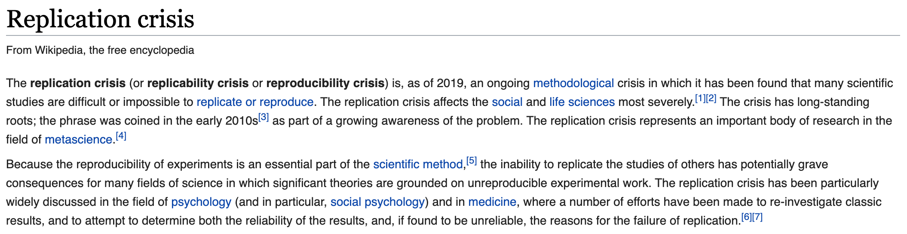
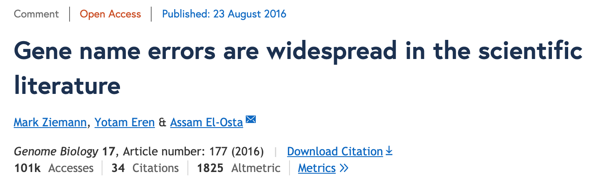
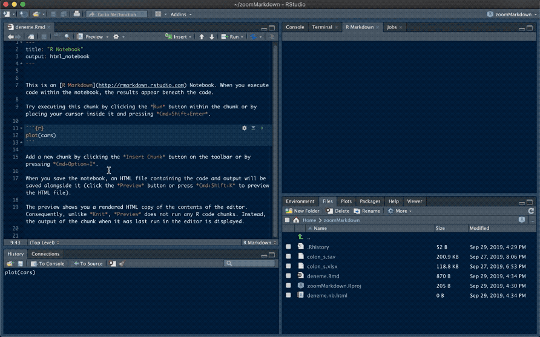
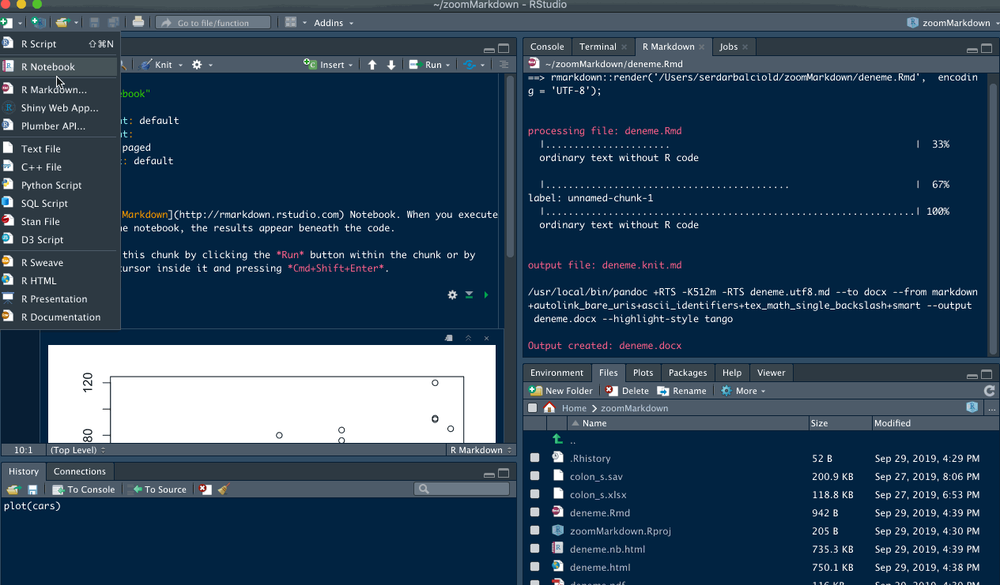
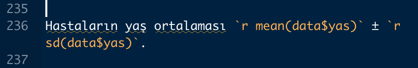
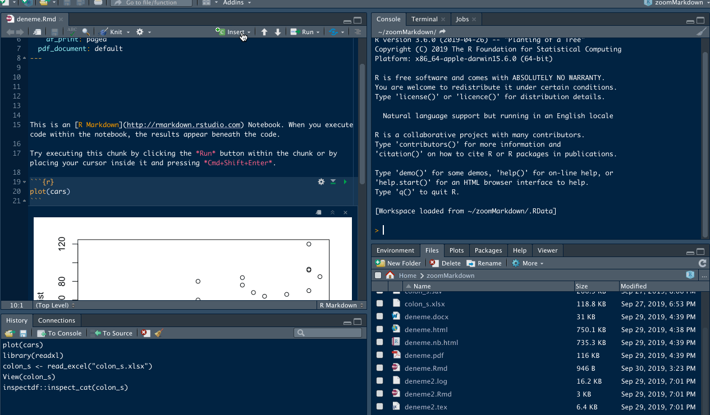
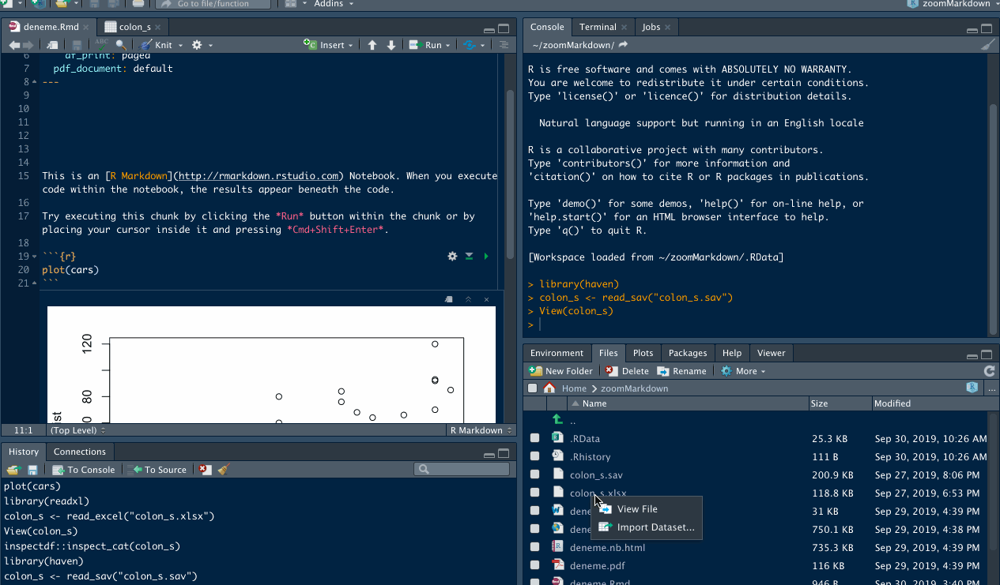
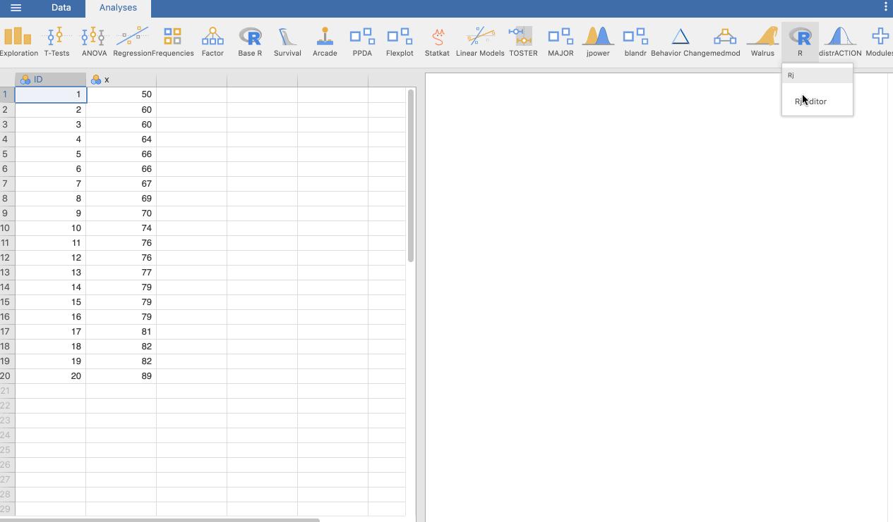
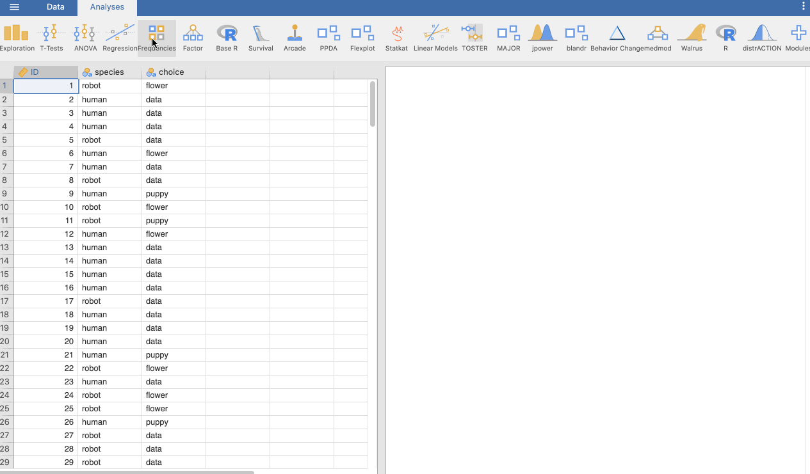
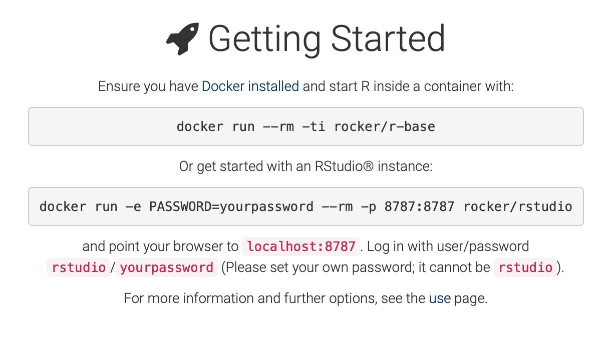

<!-- Open all links in new tab-->  
<base target="_blank"/>  


<!-- Go to www.addthis.com/dashboard to customize your tools --> <script type="text/javascript" src="//s7.addthis.com/js/300/addthis_widget.js#pubid=ra-5bc36900a405090b">  
</script>


```{r global_options, include=FALSE}
knitr::opts_chunk$set(fig.width = 12, fig.height = 8, fig.path = 'Figs/', echo = FALSE, warning = FALSE, message = FALSE, error = FALSE, eval = TRUE, tidy = TRUE, comment = NA, cache = TRUE)
```


```{r eval=FALSE, message=FALSE, warning=FALSE, include=FALSE}
# xaringan::inf_mr()
# servr::daemon_stop(1)
```


# Tekrarlanabilir Analiz ve Rapor


[](https://the-turing-way.netlify.com/reproducibility/03/definitions.html)


---


## Replication Crisis



https://en.wikipedia.org/wiki/Replication_crisis


---

## Replication Crisis Excel Version

[](https://genomebiology.biomedcentral.com/articles/10.1186/s13059-016-1044-7)


---

# RStudio ile proje oluştur


---

# R Notebook  

## R Notebook dökümanı oluşturma 


---

## R Notebook'tan html, pdf ve word oluşturma  





---

## RNotebook vs RMarkdown  

<iframe width="560" height="315" src="https://www.youtube.com/embed/zNzZ1PfUDNk" frameborder="0" allow="accelerometer; autoplay; encrypted-media; gyroscope; picture-in-picture" allowfullscreen></iframe>  

https://youtu.be/zNzZ1PfUDNk


---

# R Markdown

## Hem kendi kodları hem de html kodları yazılabilir

https://rmarkdown.rstudio.com

<iframe src="https://player.vimeo.com/video/178485416?color=428bca&title=0&byline=0&portrait=0" width="640" height="400" frameborder="0" allow="autoplay; fullscreen" allowfullscreen></iframe>
<p><a href="https://vimeo.com/178485416">What is R Markdown?</a> from <a href="https://vimeo.com/rstudioinc">RStudio, Inc.</a> on <a href="https://vimeo.com">Vimeo</a>.</p>

---

## R Markdown: The Definitive Guide

https://bookdown.org/yihui/rmarkdown/


---

## R Markdown syntax

https://gist.github.com/MinhasKamal/7fdebb7c424d23149140


<script src="https://gist.github.com/MinhasKamal/7fdebb7c424d23149140.js"></script>


---

## Remedy Package  

[](https://github.com/ThinkR-open/remedy)


---

### Remedy  

[](https://github.com/ThinkR-open/remedy)


---

## R Markdown paket ve şablonları  

https://bookdown.org/yihui/rmarkdown/document-templates.html





---

## Render Markdown via code

*inside R*

```
markdown::markdownToHTML('markdown_example.md', 
'markdown_example.html')
```

*command line*

```
R -e "markdown::markdownToHTML('markdown_example.md',
'markdown_example.html')"
```

---


## pandoc Rstudio integration

*command line*

```
export PATH=$PATH:/Applications/RStudio.app/Contents/MacOS/pandoc
```


```
R -e "rmarkdown::render('markdown_example.md')"
```


---

# RMarkdown `chunk` içinde `R` kodlarını çalıştırma


```
{r, results='asis'}
 iris %>%
  tibble::as_tibble() %>%
  details::details(summary = 'tibble')
```

---

# Metin arasında `R` kodlarını çalıştırma





---

# Chunk Options

## Global Options

```
{r global_options, include=FALSE}
knitr::opts_chunk$set(fig.width = 12,
                      fig.height = 8,
                      fig.path = 'Figs/',
                      echo = FALSE,
                      warning = FALSE,
                      message = FALSE,
                      error = FALSE,
                      eval = TRUE,
                      tidy = TRUE,
                      comment = NA)
```

---

## Other Code Languages


[](https://rmarkdown.rstudio.com/lesson-5.html)


---


# R Markdown kod örneği  


```
{r}
data("cancer")
cancer
foreign::write.foreign(df = cancer,
                        datafile = "data/cancer.sav",
                        codefile = "data/cancer.spo",
                        package = "SPSS"
                        )
```


---

# R Markdown Paket Çağırma 📦    


```
{r}
suppressPackageStartupMessages(library("tidyverse"))
suppressPackageStartupMessages(library("survival"))
```

---

## Sık kullandığım paketler 📦  

{tidyverse}
{tidylog}

{lubridate}
{janitor}

{readxl}
{foreign}

{summarytools}
{ggstatsplot}
{tangram}
{finalfit}
{psycho}
{jmv}

{survival}
{survminer}

{report}
{kableExtra}

---

# R Markdown Veri Yükleme SPSS  




---

# R Markdown Veri Yükleme Excel  





---

# Veri Görüntüleme


```
{r}
View(mydata)
glimpse(mydata)
```


---

# Veri Düzenleme

```
{r}
mydata <- janitor::clean_names(mydata)
```

```
{r}
mydata$sontarih <- janitor::excel_numeric_to_date(
  as.numeric(mydata$olum_tarihi)
  )
```


---

# Recode


```
{r}
mydata$Outcome <- "Dead"
mydata$Outcome[mydata$olum_tarihi == "yok"] <- "Alive"
```


```
{r}
## Recoding mydata$cinsiyet into mydata$Cinsiyet
mydata$Cinsiyet <- recode(mydata$cinsiyet,
               "K" = "Kadin",
               "E" = "Erkek")
mydata$Cinsiyet <- factor(mydata$Cinsiyet)
```


---

# Recode regular expression


```
{r recode TNM stage}
#pT2N0Mx -> 2
mydata$Tstage <- stringr::str_match(
  mydata$patolojik_evre, 
  paste('(.+)', "N", sep=''))[,2]
)
```


---

# Recode regular expression case_when

```
{r recode TNM2}
mydata <- mydata %>% 
    mutate(
        T_stage = case_when(
            grepl(pattern = "T1", x = .$Tstage) == TRUE ~ "T1",
            grepl(pattern = "T2", x = .$Tstage) == TRUE ~ "T2",
            grepl(pattern = "T3", x = .$Tstage) == TRUE ~ "T3",
            grepl(pattern = "T4", x = .$Tstage) == TRUE ~ "T4",
            TRUE ~ "Tx"
        )
    )
```

---

# Recode regular expression case_when

```
{r}
mydata <- mydata %>% 
    mutate(
TumorPDL1gr1 = case_when(
        t_pdl1 < 1 ~ "kucuk1",
        t_pdl1 >= 1 ~ "buyukesit1"
    )
    )
```

---

# R Markdown Tanımlayıcı İstatistikler  


```
{r}
library(summarytools)
view(dfSummary(colon_s))
```


---


A beginner kit for #rstats
The Landscape of R Packages for Automated Exploratory Data Analysis
https://journal.r-project.org/archive/2019/RJ-2019-033/


@article{RJ-2019-033,
  author = {Mateusz Staniak and Przemysław Biecek},
  title = {{The Landscape of R Packages for Automated Exploratory Data
          Analysis}},
  year = {2019},
  journal = {{The R Journal}},
  doi = {10.32614/RJ-2019-033},
  url = {https://journal.r-project.org/archive/2019/RJ-2019-033/index.html}
}


---


## Table One  


```
{r, results='asis'}
# cat(names(mydata), sep = " + \n")
library(arsenal)
tab1 <- tableby(~ Cinsiyet + 
Yas + 
TumorYerlesimi
                ,
                data = mydata)
summary(tab1)
```

---

## The Grammar of Tables


[tangram: The Grammar of Tables](https://cran.r-project.org/web/packages/tangram/)

[A grammar of tables](https://github.com/leeper/tttable)

[Grammar of Tables?](https://gist.github.com/leeper/f9cfbe6bd185763762e126a4d8d7c286)

[Easily generate information-rich, publication-quality tables from R](https://gt.rstudio.com)


---

## Kategorik Veriler

```
{r}
mydata %>% 
  janitor::tabyl(Categorical) %>%
  adorn_pct_formatting(rounding = 'half up',
                       digits = 1) %>%
  knitr::kable()
```

```
{r crosstable}
mydata %>%
    summary_factorlist(dependent = dependent, 
                       explanatory = explanatory,
                       total_col = TRUE,
                       p = TRUE,
                       add_dependent_label = TRUE) -> table
knitr::kable(table, row.names = FALSE, align = c('l', 'l', 'r', 'r', 'r'))
```

---

## Kategorik Veriler için Grafikler  

```
{r ggstatplot, layout='l-page'}
mydata %>% 
    ggstatsplot::ggbarstats(data = .,
                            main = Categorical_variable,
                            condition =  dependent_variable
                            )
```

---


## Continious Variables

```
{r}
mydata %>% 
jmv::descriptives(
    data = .,
    vars = c(yas),
    hist = TRUE,
    dens = TRUE,
    box = TRUE,
    violin = TRUE,
    dot = TRUE,
    mode = TRUE,
    sd = TRUE,
    variance = TRUE,
    skew = TRUE,
    kurt = TRUE,
    quart = TRUE)
```

---

# R Markdown örneği Çapraz Tablolar  

```
{r crosstable}
library(finalfit)
mydata %>%
    summary_factorlist(dependent = dependent, 
                       explanatory = explanatory,
                       column = TRUE,
                       total_col = TRUE,
                       p = TRUE,
                       add_dependent_label = TRUE,
                       na_include=FALSE
                       # catTest = catTestfisher
                       ) -> table
knitr::kable(table,
             row.names = FALSE,
             align = c('l', 'l', 'r', 'r', 'r'))
```

---

# R Markdown örneği Sağkalım  

- Drawing Survival Curves Using ggplot2  
https://rpkgs.datanovia.com/survminer/reference/ggsurvplot.html

## Sağkalım için veriyi düzenleme

```
{r define survival time}
mydata$int <- lubridate::interval(
  lubridate::ymd(mydata$CerrahiTarih),
  lubridate::ymd(mydata$SonTarih)
  )
mydata$OverallTime <- lubridate::time_length(mydata$int, "month")
mydata$OverallTime <- round(mydata$OverallTime, digits = 1)
```

```
{r}
## Recoding mydata$Outcome into mydata$Outcome2
mydata$Outcome2 <- recode(mydata$Outcome,
               "Alive" = "0",
               "Dead" = "1")
mydata$Outcome2 <- as.numeric(mydata$Outcome2)
```

---

## Kaplan-Meier

```
{r Kaplan-Meier}
mydata %>%
  finalfit::surv_plot(dependent,
                      explanatory,
                      xlab='Time (months)',
                      pval=TRUE,
                      legend = 'none',
                      break.time.by = 12,
                      xlim = c(0,60),
                      legend.labs = c('a','b')
)
```

---

## Sağkalım Tabloları

```
{r}
km_fit <- survfit(dependent ~ explanatory,
                  data = mydata)
km_fit
```

```
{r, eval=FALSE, include=FALSE}
library(survival)
km <- with(mydata, Surv(OverallTime, Outcome2))
# head(km,80)
# plot(km)
```

```
{r 1-3-5-yr}
summary(km_fit, times = c(12,36,60))
```

---

## Pairwise comparison

```
{r}
survminer::pairwise_survdiff(formula = Surv(time, Outcome) ~ Group, 
                             data = mydata,
                             p.adjust.method = "BH")
```

---

## Multivariate Analysis Survival

```
{r Multivariate Analysis, eval=FALSE, include=FALSE}
library(finalfit)
library(survival)
explanatoryMultivariate <- explanatoryKM
dependentMultivariate <- dependentKM
mydata %>%
  finalfit(dependentMultivariate, explanatoryMultivariate) -> tMultivariate
knitr::kable(tMultivariate, row.names=FALSE, align=c("l", "l", "r", "r", "r", "r"))
```

---

# jamovi

## jamovi ve R entegrasyonu

[Rj Editor – Analyse your data with R in jamovi](https://blog.jamovi.org/2018/07/30/rj.html)



---

## {jmv} paket kodları

[jamovi syntax mode](https://www.jamovi.org/user-manual.html#syntax-mode)





---

# Güncellemeler olunca kodlar çalışacak mı?


---

## Paket Kütüphaneleri

- packrat / renv

https://environments.rstudio.com

---

## Docker

- docker

---

### The Rocker Project

Docker Containers for the R Environment

```
docker run --rm -ti rocker/r-base
```

Or get started with an RStudio® instance:

```
docker run -e PASSWORD=yourpassword --rm -p 8787:8787 rocker/rstudio
```

and point your browser to [localhost:8787](localhost:8787)
Log in with user/password rstudio/yourpassword 

---

[](https://www.rocker-project.org)

[Managing containers](https://www.rocker-project.org/use/managing_containers/)


---

## Yeni R sürümleri 

- RSwitch

https://rud.is/rswitch/

- Using RSwitch

https://rud.is/rswitch/guide/


---

# Yedeklemeyi nasıl yapacağız

## Projeyi düzgün organize edin

- pdf
- R
- images
- bib

```
{r load library}
source(file = here::here("R", "loadLibrary.R"))
```

---

## Save Final Data

```
{r}
saved data after analysis to `mydata.xlsx`.

save.image(file = here::here("data", "mydata_work_space.RData"))

readr::write_rds(x = mydata, path = here::here("data", "mydata_afteranalysis.rds"))

saveRDS(object = mydata, file = here::here("data", "mydata.rds"))

writexl::write_xlsx(mydata, here::here("data", "mydata.xlsx"))

paste0(rownames(file.info(here::here("data", "mydata.xlsx"))), " : ", file.info(here::here("data", "mydata.xlsx"))$ctime)

```

---

## GitHub  

```
{r github push}
CommitMessage <- paste("updated on ", Sys.time(), sep = "")
wd <- getwd()
gitCommand <- paste("cd ", 
                    wd,
                    " \n git add . \n git commit --message '",
                    CommitMessage,
                    "' \n git push origin master \n",
                    sep = ""
                    )
system(command = gitCommand,
       intern = TRUE
)
```

---

## GitHub Yedekleme

```{r github push, echo=TRUE}
CommitMessage <- paste("updated on ", Sys.time(), sep = "")
wd <- getwd()
gitCommand <- paste("cd ", 
                    wd,
                    " \n git add . \n git commit --message '",
                    CommitMessage,
                    "' \n git push origin master \n",
                    sep = ""
                    )
system(command = gitCommand,
       intern = TRUE
)
```

---

# Her dökümanın sonuna kullandığınız kütüphaneler için atıf yazdırabilirsiniz

```
{r}
citation()
```

---

## Libraries Used  

```{r library citation, echo=TRUE}
citation()
```

---

## Bu oturuma spesifik kullanılan paketler  

```{r library citation as report, echo=TRUE, results='asis'}
report::cite_packages(session = sessionInfo())
```


---

## Tek tek paket atıfları


```
{r library citations}
citation("tidyverse")
citation("readxl")
citation("janitor")
citation("report")
citation("finalfit")
citation("ggstatplot")
```


---

## Jamovi ve R için atıf örneği

- The jamovi project (2019). jamovi. (Version 0.9) [Computer Software]. Retrieved from https://www.jamovi.org.

- R Core Team (2018). R: A Language and envionment for statistical computing. [Computer software]. Retrieved from https://cran.r-project.org/.

- Fox, J., & Weisberg, S. (2018). car: Companion to Applied Regression. [R package]. Retrieved from https://cran.r-project.org/package=car.


---

# Her dökümanın sonuna oturum detaylarınızı yazdırabilirsiniz  

```
{r session info, echo=TRUE}
sessionInfo()
```

---

## Session Info

```{r session info, echo=TRUE}
sessionInfo()
```

---

# Sonraki Konular

- RStudio ile GitHub kullanımı
- ...

---

# Önerilen Kaynaklar

- [Reproducible Templates for Analysis and Dissemination](https://www.coursera.org/learn/reproducible-templates-analysis/home/info)

- [Happy Git and GitHub for the useR](https://happygitwithr.com/)


---

# Sunum Linkleri

https://sbalci.github.io/MyRCodesForDataAnalysis/R-Markdown.nb.html
https://sbalci.github.io/MyRCodesForDataAnalysis/R-Markdown.html

https://forms.gle/UqGJBiAjB8uLPRon8

---

# Geri Bildirim

- Geri bildirim için tıklayınız: _[Geri bildirim formu](https://goo.gl/forms/YjGZ5DHgtPlR1RnB3)_


---

<script id="dsq-count-scr" src="//https-sbalci-github-io.disqus.com/count.js" async></script>

<div id="disqus_thread"></div>
<script>

/**
*  RECOMMENDED CONFIGURATION VARIABLES: EDIT AND UNCOMMENT THE SECTION BELOW TO INSERT DYNAMIC VALUES FROM YOUR PLATFORM OR CMS.
*  LEARN WHY DEFINING THESE VARIABLES IS IMPORTANT: https://disqus.com/admin/universalcode/#configuration-variables*/
/*
var disqus_config = function () {
this.page.url = PAGE_URL;  // Replace PAGE_URL with your page's canonical URL variable
this.page.identifier = PAGE_IDENTIFIER; // Replace PAGE_IDENTIFIER with your page's unique identifier variable
};
*/
(function() { // DON'T EDIT BELOW THIS LINE
var d = document, s = d.createElement('script');
s.src = 'https://https-sbalci-github-io.disqus.com/embed.js';
s.setAttribute('data-timestamp', +new Date());
(d.head || d.body).appendChild(s);
})();
</script>
<noscript>Please enable JavaScript to view the <a href="https://disqus.com/?ref_noscript">comments powered by Disqus.</a></noscript>

---

# İletişim  

Completed on `r Sys.Date()`.  

Serdar Balci, MD, Pathologist  
drserdarbalci@gmail.com  

https://rpubs.com/sbalci/CV   
https://sbalci.github.io/  
https://github.com/sbalci  
https://twitter.com/serdarbalci


---

   


---


# Other Links


https://andrewbtran.github.io/NICAR/2018/workflow/docs/02-rmarkdown.html

- Troubleshooting in R Markdown

https://smithcollege-sds.github.io/sds-public/rmarkdown_problems.html


http://kbroman.org/knitr_knutshell/pages/Rmarkdown.html

https://kbroman.org/knitr_knutshell/pages/overview.html

https://kbroman.org/knitr_knutshell/pages/Rmarkdown.html

https://kbroman.org/knitr_knutshell/pages/markdown.html


https://onp4.com/


```
csv {headers: true, title: "**Drawing Tables In Markdown**"}
Name, Surname, Known As, Age
Marcelo, David, coldzera, 22
Oleksandr, Kostyliev, s1mple, 19
Nikola, Kovač, NiKo, 20
Richard, Papillon, shox, 25
Nicolai, Reedtz, dev1ce, 21
```

```
{pgn}
[Event "Bled-Zagreb-Belgrade Candidates"]
[Site "Bled, Zagreb & Belgrade YUG"]
[Date "1959.10.11"]
[Round "20"]
[Result "1-0"]
[White "Mikhail Tal"]
[Black "Robert James Fischer"]

1. d4 Nf6 2. c4 g6 3. Nc3 Bg7 4. e4 d6 5.
Be2 O-O 6. Nf3 e5 7. d5 Nbd7 8. Bg5 h6 9.
Bh4 a6 10. O-O Qe8 11. Nd2 Nh7 12. b4 Bf6
13. Bxf6 Nhxf6 14. Nb3 Qe7 15. Qd2 Kh7 16.
Qe3 Ng8 17. c5 f5 18. exf5 gxf5 19. f4 exf4
20. Qxf4 dxc5 21. Bd3 cxb4 22. Rae1 Qf6 23.
Re6 Qxc3 24. Bxf5+ Rxf5 25. Qxf5+ Kh8 26.
Rf3 Qb2 27. Re8 Nf6 28. Qxf6+ Qxf6 29. Rxf6
Kg7 30. Rff8 Ne7 31. Na5 h5 32. h4 Rb8 33.
Nc4 b5 34. Ne5 1-0
```


- Keeping Credentials Secret with Keyrings in R

https://ras44.github.io/blog/2019/01/19/keeping-credentials-secret-with-keyrings-in-r.html

- How to build a website with Blogdown in R

http://www.storybench.org/how-to-build-a-website-with-blogdown-in-r/
