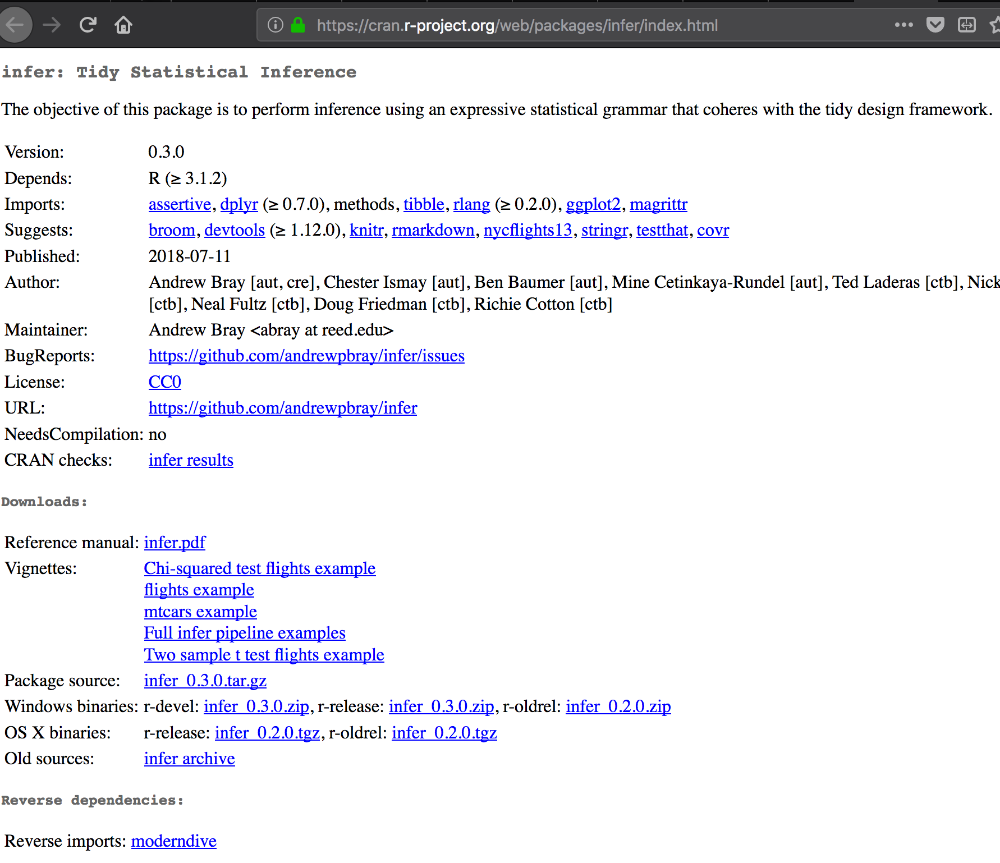
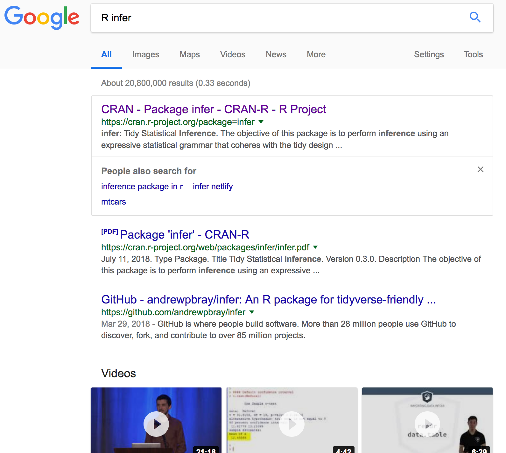
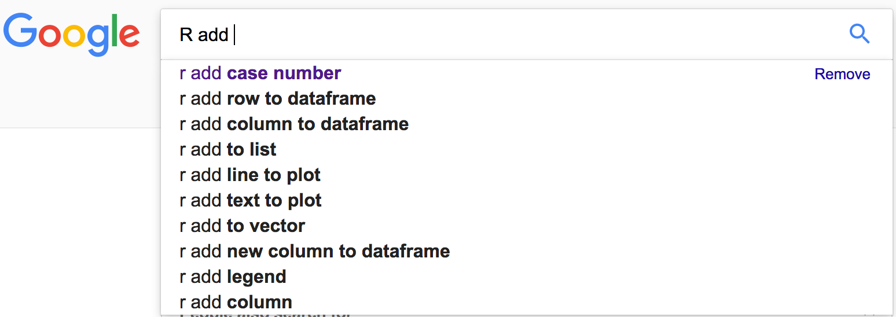
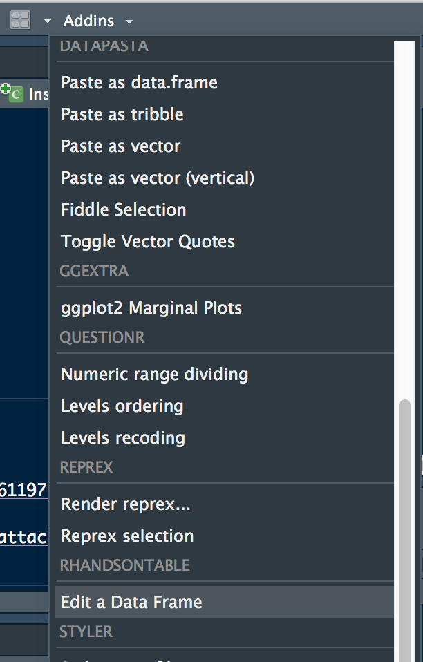
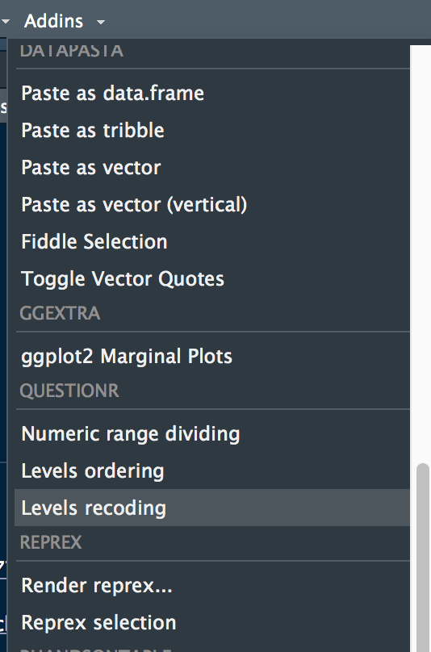
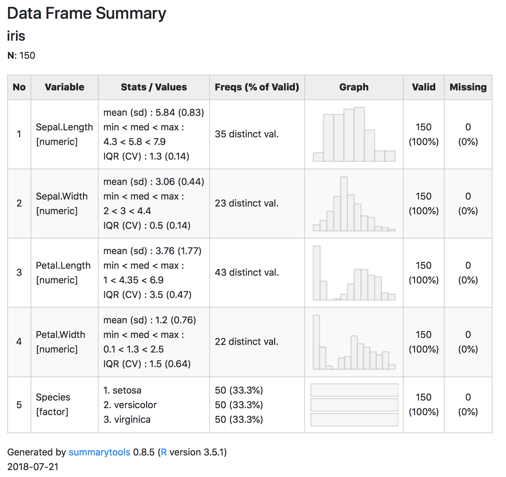
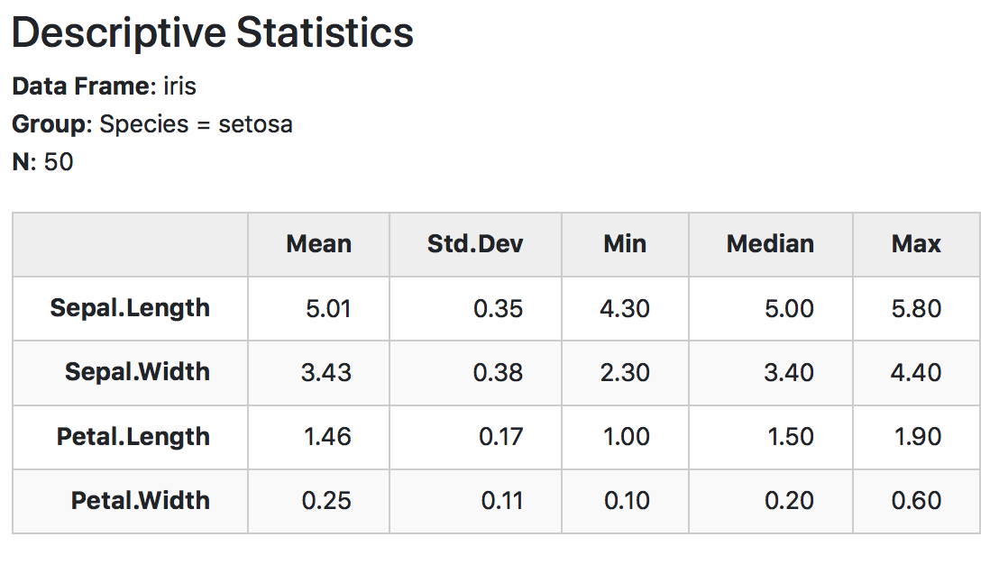

title: R ile analize başlarken^[Bu bir derlemedir, mümkün mertebe alıntılara referans
  vermeye çalıştım.]


```
{r , echo=TRUE, cache=FALSE}
library(knitr)
library(rmdformats)

## Global options
options(max.print= 75 )
opts_chunk$set(echo=TRUE,
	             cache=TRUE,
               prompt=FALSE,
               tidy=TRUE,
               comment=NA,
               message=FALSE,
               warning=FALSE)
opts_knit$set(width=75)
```


<!-- Open all links in new tab-->  
<!-- <base target= _blank />    -->


<!-- Go to www.addthis.com/dashboard to customize your tools --> <script type= text/javascript  src= //s7.addthis.com/js/300/addthis_widget.js#pubid=ra-5bc36900a405090b >  
</script> 

# R hakkında


[](https://www..com/community/tutorials/data-science-pitfalls)


- R generation

https://rss.onlinelibrary.wiley.com/doi/10.1111/j.1740-9713.2018.01169.x


# R yükleme

http://www.youtube.com/watch?v=XcBLEVknqvY

[](http://www.youtube.com/watch?v=XcBLEVknqvY)


## R-project

https://cran.r-project.org/


[](https://ismayc.github.io/talks/ness-infer/slide_deck.html#6)


## RStudio

https://www.rstudio.com/

https://www.rstudio.com/products/rstudio/download/

https://moderndive.com/2-getting-started.html


<!-- [](https://buzzrbeeline.blog/2018/07/04/rstudio-anatomy/) -->


### RStudio eklentileri

- Discover and install useful RStudio addins

https://cran.r-project.org/web/packages/addinslist/README.html

https://rstudio.github.io/rstudioaddins/


```
{r eval=FALSE, include=FALSE, echo=TRUE}
# devtools::install_github( rstudio/addinexamples , type =  source )
```


## X11

https://www.xquartz.org/


## Java OS

https://support.apple.com/kb/dl1572


# R zor şeyler için kolay, kolay şeyler için zor


- [R makes easy things hard, and hard things easy](http://r4stats.com/articles/why-r-is-hard-to-learn/)


- Aynı şeyi çok fazla şekilde yapmak mümkün

R Syntax Comparison::CHEAT SHEET

https://www.amelia.mn/Syntax-cheatsheet.pdf


# R paketleri


## Neden paketler var

[](https://ismayc.github.io/talks/ness-infer/slide_deck.html#7)


<script async src= https://platform.twitter.com/widgets.js  charset= utf-8 ></script><blockquote class= twitter-tweet  data-lang= en ><p lang= en  dir= ltr >I love the <a href= https://twitter.com/hashtag/rstats?src=hash&amp;ref_src=twsrc%5Etfw >#rstats</a> community.<br>Someone is like, &quot;oh hey peeps, I saw a big need for this mundane but difficult task that I infrequently do, so I created a package that will literally scrape the last bits of peanut butter out of the jar for you. It&#39;s called pbplyr.&quot;<br>What a tribe.</p>&mdash; Frank Elavsky ᴰᵃᵗᵃ ᵂᶦᶻᵃʳᵈ (@Frankly_Data) <a href= https://twitter.com/Frankly_Data/status/1014189095294291968?ref_src=twsrc%5Etfw >July 3, 2018</a></blockquote>


https://blog.mitchelloharawild.com/blog/user-2018-feature-wall/


## Paketleri nereden bulabiliriz

- Available CRAN Packages By Name  
https://cran.r-project.org/web/packages/available_packages_by_name.html

- Bioconductor  
https://www.bioconductor.org

- RecommendR  
http://recommendr.info/

- pkgsearch  
CRAN package search  
https://github.com/metacran/pkgsearch

- Awesome R  
https://awesome-r.com/  


## Kendi paket evrenini oluştur

- pkgverse: Build a Meta-Package Universe  
https://cran.r-project.org/web/packages/pkgverse/index.html


## R için yardım bulma


```
# ?mean
# ??efetch
# help(merge)
# example(merge)
```


- Vignette




- RDocumentation
https://www.rdocumentation.org

- R Package Documentation
https://rdrr.io/

- GitHub

- Stackoverflow

https://stackoverflow.com/

- Google uygun anahtar kelime


<script async src= https://platform.twitter.com/widgets.js  charset= utf-8 ></script><blockquote class= twitter-tweet  data-lang= en ><p lang= en  dir= ltr >How I use <a href= https://twitter.com/hashtag/rstats?src=hash&amp;ref_src=twsrc%5Etfw >#rstats</a> <br>h/t <a href= https://twitter.com/ThePracticalDev?ref_src=twsrc%5Etfw >@ThePracticalDev</a> <a href= https://t.co/erRnTG0Ujr >pic.twitter.com/erRnTG0Ujr</a></p>&mdash; Emily Bovee (@ebovee09) <a href= https://twitter.com/ebovee09/status/1028037594947485696?ref_src=twsrc%5Etfw >August 10, 2018</a></blockquote>








- Awesome Cheatsheet
https://github.com/detailyang/awesome-cheatsheet

http://cran.r-project.org/doc/contrib/Baggott-refcard-v2.pdf

https://www.rstudio.com/resources/cheatsheets/


- Awesome R

https://github.com/qinwf/awesome-R#readme

https://awesome-r.com/


- Twitter

https://twitter.com/hashtag/rstats?src=hash


- Reproducible Examples

<blockquote class= twitter-tweet  data-lang= en ><p lang= en  dir= ltr >Got a question to ask on <a href= https://twitter.com/SlackHQ?ref_src=twsrc%5Etfw >@SlackHQ</a> or post on <a href= https://twitter.com/github?ref_src=twsrc%5Etfw >@github</a>? No time to read the long post on how to use reprex? Here is a 20-second gif for you to format your R codes nicely and for others to reproduce your problem. (An example from a talk given by <a href= https://twitter.com/JennyBryan?ref_src=twsrc%5Etfw >@JennyBryan</a>) <a href= https://twitter.com/hashtag/rstat?src=hash&amp;ref_src=twsrc%5Etfw >#rstat</a> <a href= https://t.co/gpuGXpFIsX >pic.twitter.com/gpuGXpFIsX</a></p>&mdash; ZhiYang (@zhiiiyang) <a href= https://twitter.com/zhiiiyang/status/1053006003711569920?ref_src=twsrc%5Etfw >October 18, 2018</a></blockquote><script async src= https://platform.twitter.com/widgets.js  charset= utf-8 ></script>


## R paket yükleme

```
install.packages( tidyverse , dependencies = TRUE)
install.packages( jmv , dependencies = TRUE)
install.packages( questionr , dependencies = TRUE)
install.packages( Rcmdr , dependencies = TRUE)
install.packages( summarytools )
```

```
{r}
# install.packages( tidyverse , dependencies = TRUE)
# install.packages( jmv , dependencies = TRUE)
# install.packages( questionr , dependencies = TRUE)
# install.packages( Rcmdr , dependencies = TRUE)
# install.packages( summarytools )
```


```
{r, error=FALSE, message = FALSE, warning = FALSE, eval = TRUE, include = TRUE}
# require(tidyverse)
# require(jmv)
# require(questionr)
# library(summarytools)
# library(gganimate)
```


# R studio ile proje oluşturma

https://support.rstudio.com/hc/en-us/articles/200526207-Using-Projects


# RStudio ile veri yükleme

https://support.rstudio.com/hc/en-us/articles/218611977-Importing-Data-with-RStudio


## Excel

## SPSS

## csv


# Veriyi görüntüleme

<script async src= https://platform.twitter.com/widgets.js  charset= utf-8 ></script><blockquote class= twitter-tweet  data-lang= en ><p lang= en  dir= ltr >Spreadsheet users using <a href= https://twitter.com/hashtag/rstats?src=hash&amp;ref_src=twsrc%5Etfw >#rstats</a>:  where&#39;s the data?<a href= https://twitter.com/hashtag/rstats?src=hash&amp;ref_src=twsrc%5Etfw >#rstats</a> users using spreadsheets:  where&#39;s the code?</p>&mdash; Leonard Kiefer (@lenkiefer) <a href= https://twitter.com/lenkiefer/status/1015587475580956672?ref_src=twsrc%5Etfw >July 7, 2018</a></blockquote>


```
{r, results= markup }
# library(nycflights13)
# summary(flights)
```


```
View(data)
```


```
data
```


```
head
```


```
tail
```


```
glimpse
```


```
str
```


```
skimr::skim()
```


# Veriyi değiştirme

## Veriyi kod ile değiştirelim

## Veriyi eklentilerle değiştirme




## RStudio aracılığıyla recode

*questionr* paketi kullanılacak




https://juba.github.io/questionr/articles/recoding_addins.html


# Basit tanımlayıcı istatistikler

```
summary()
```

```
mean
```

```
median
```

```
min
```

```
max
```

```
sd
```

```
table()
```


```
{r, echo=TRUE, include = TRUE}
library(readr)
irisdata <- read_csv( data/iris.csv )

jmv::descriptives(
    data = irisdata,
    vars =  Sepal.Length ,
    splitBy =  Species ,
    freq = TRUE,
    hist = TRUE,
    dens = TRUE,
    bar = TRUE,
    box = TRUE,
    violin = TRUE,
    dot = TRUE,
    mode = TRUE,
    sum = TRUE,
    sd = TRUE,
    variance = TRUE,
    range = TRUE,
    se = TRUE,
    skew = TRUE,
    kurt = TRUE,
    quart = TRUE,
    pcEqGr = TRUE)
```


```
{r, echo=TRUE, include=FALSE}
# install.packages( scatr )

scatr::scat(
    data = irisdata,
    x =  Sepal.Length ,
    y =  Sepal.Width ,
    group =  Species ,
    marg =  dens ,
    line =  linear ,
    se = TRUE)

```

## summarytools

https://cran.r-project.org/web/packages/summarytools/vignettes/Introduction.html

```
{r, include=FALSE, comment=NA, prompt=FALSE, cache=FALSE, echo=TRUE, results='asis'}
library(summarytools)
summarytools::freq(iris$Species, style =  rmarkdown )
```

```
{r, include=FALSE, comment=NA, prompt=FALSE, cache=FALSE, echo=TRUE, results='asis'}
summarytools::freq(iris$Species, report.nas = FALSE, style =  rmarkdown , headings = TRUE)
```


```
{r, include=FALSE, comment=NA, prompt=FALSE, cache=FALSE, echo=TRUE, results='asis'}
with(tobacco, print(ctable(smoker, diseased), method = 'render'))
```


```
{r, include=FALSE, comment=NA, prompt=FALSE, cache=FALSE, echo=TRUE, results='asis'}
with(tobacco, 
     print(ctable(smoker, diseased, prop = 'n', totals = FALSE), 
           headings = TRUE, method =  render ))
```


```
{r, include=FALSE, comment=NA, prompt=FALSE, cache=FALSE, echo=TRUE, results='asis'}
summarytools::descr(iris, style =  rmarkdown )
```


```
{r, include=FALSE, comment=NA, prompt=FALSE, cache=FALSE, echo=TRUE, results='asis'}
descr(iris, stats = c( mean ,  sd ,  min ,  med ,  max ), transpose = TRUE, 
      headings = TRUE, style =  rmarkdown )
```


```
{r, include=FALSE, comment=NA, prompt=FALSE, cache=FALSE, echo=TRUE, results='asis'}
# view(dfSummary(iris))

```





```
{r, include=FALSE, comment=NA, prompt=FALSE, cache=FALSE, echo=TRUE, results='asis'}
dfSummary(tobacco, plain.ascii = FALSE, style =  grid )
```


```
{r, include=FALSE, comment=NA, prompt=FALSE, cache=FALSE, echo=TRUE, results='asis'}

# First save the results

iris_stats_by_species <- by(data = iris, 
                            INDICES = iris$Species, 
                            FUN = descr, stats = c( mean ,  sd ,  min ,  med ,  max ), 
                            transpose = TRUE)

# Then use view(), like so:

view(iris_stats_by_species, method =  pander , style =  rmarkdown )
```

```
{r, include=FALSE, comment=NA, prompt=FALSE, cache=FALSE, echo=TRUE, results='asis'}
# view(iris_stats_by_species)
```




```
{r, include=FALSE, comment=NA, prompt=FALSE, cache=FALSE, echo=TRUE, results='asis'}
data(tobacco) # tobacco is an example dataframe included in the package
BMI_by_age <- with(tobacco, 
                   by(BMI, age.gr, descr, 
                      stats = c( mean ,  sd ,  min ,  med ,  max )))
view(BMI_by_age,  pander , style =  rmarkdown )
```


```
{r, include=FALSE, comment=NA, prompt=FALSE, cache=FALSE, echo=TRUE, results='asis'}
BMI_by_age <- with(tobacco, 
                   by(BMI, age.gr, descr,  transpose = TRUE,
                      stats = c( mean ,  sd ,  min ,  med ,  max )))

view(BMI_by_age,  pander , style =  rmarkdown , headings = TRUE)
```


```
{r, include=FALSE, comment=NA, prompt=FALSE, cache=FALSE, echo=TRUE, results='asis'}
tobacco_subset <- tobacco[ ,c( gender ,  age.gr ,  smoker )]
freq_tables <- lapply(tobacco_subset, freq)

# view(freq_tables, footnote = NA, file = 'freq-tables.html')
```


```
{r, include=FALSE, comment=NA, prompt=FALSE, cache=FALSE, echo=TRUE, results='asis'}
what.is(iris)
```


```
{r eval=FALSE, include=FALSE, echo=TRUE}
freq(tobacco$gender, style = 'rmarkdown')
```


```
{r eval=FALSE, include=FALSE, echo=TRUE}
print(freq(tobacco$gender), method = 'render')
```


## skimr

```
library(skimr)
skim(df)
```


## DataExplorer

```
library(DataExplorer)
DataExplorer::create_report(df)
```


[](https://www.littlemissdata.com/blog/simple-eda)


## Grafikler

```
{r eval=FALSE, include=FALSE, echo=TRUE}
# library(ggplot2)
# library(mosaic)
# mPlot(irisdata)
```


```
{r eval=FALSE, include=FALSE, echo=TRUE}
ctable(tobacco$gender, tobacco$smoker, style = 'rmarkdown')
```


```
{r eval=FALSE, include=FALSE, echo=TRUE}
print(ctable(tobacco$gender, tobacco$smoker), method = 'render')
```

```
descr(tobacco, style = 'rmarkdown')

print(descr(tobacco), method = 'render', table.classes = 'st-small')

dfSummary(tobacco, style = 'grid', plain.ascii = FALSE)

print(dfSummary(tobacco, graph.magnif = 0.75), method = 'render')
```


<blockquote class= twitter-tweet  data-lang= en ><p lang= en  dir= ltr >Here, building up a <a href= https://twitter.com/hashtag/ggplot2?src=hash&amp;ref_src=twsrc%5Etfw >#ggplot2</a> as slowly as possible, <a href= https://twitter.com/hashtag/rstats?src=hash&amp;ref_src=twsrc%5Etfw >#rstats</a>.  Incremental adjustments.  <a href= https://twitter.com/hashtag/rstatsteachingideas?src=hash&amp;ref_src=twsrc%5Etfw >#rstatsteachingideas</a> <a href= https://t.co/nUulQl8bPh >pic.twitter.com/nUulQl8bPh</a></p>&mdash; Gina Reynolds (@EvaMaeRey) <a href= https://twitter.com/EvaMaeRey/status/1029104656763572226?ref_src=twsrc%5Etfw >August 13, 2018</a></blockquote><script async src= https://platform.twitter.com/widgets.js  charset= utf-8 ></script>


[](https://github.com/dreamRs/esquisse)


<blockquote class= twitter-tweet  data-lang= en ><p lang= en  dir= ltr >Dreaming of a fancy <a href= https://twitter.com/hashtag/Rstats?src=hash&amp;ref_src=twsrc%5Etfw >#Rstats</a> <a href= https://twitter.com/hashtag/ggplot?src=hash&amp;ref_src=twsrc%5Etfw >#ggplot</a> <a href= https://twitter.com/hashtag/dataviz?src=hash&amp;ref_src=twsrc%5Etfw >#dataviz</a> but still scared of typing <a href= https://twitter.com/hashtag/code?src=hash&amp;ref_src=twsrc%5Etfw >#code</a>? <a href= https://twitter.com/_pvictorr?ref_src=twsrc%5Etfw >@_pvictorr</a> esquisse package has you covered <a href= https://t.co/1vIDXcVAAF >https://t.co/1vIDXcVAAF</a> <a href= https://t.co/RlTkptnrNv >pic.twitter.com/RlTkptnrNv</a></p>&mdash; Radoslaw Panczak (@RPanczak) <a href= https://twitter.com/RPanczak/status/1047019588658040832?ref_src=twsrc%5Etfw >October 2, 2018</a></blockquote>
<script async src= https://platform.twitter.com/widgets.js  charset= utf-8 ></script>


# Rcmdr

```
library(Rcmdr)

Rcmdr::Commander()

```


- A Comparative Review of the R Commander GUI for R

http://r4stats.com/articles/software-reviews/r-commander/


# jamovi

https://www.jamovi.org/

](https://www.jamovi.org/)


https://blog.jamovi.org/2018/07/30/rj.html

](https://blog.jamovi.org/2018/07/30/rj.html)


# Sonraki Konular

- RStudio ile GitHub
- Hipotez testleri
- R Markdown ve R Notebook ile tekrarlanabilir rapor


# Diğer kodlar

- Diğer kodlar için bakınız: [https://sbalci.github.io/](https://sbalci.github.io/)


# Geri Bildirim

- Geri bildirim için tıklayınız: _[Geri bildirim formu](https://goo.gl/forms/YjGZ5DHgtPlR1RnB3)_


<script id= dsq-count-scr  src= //https-sbalci-github-io.disqus.com/count.js  async></script>

<div id= disqus_thread ></div>
<script>

/**
*  RECOMMENDED CONFIGURATION VARIABLES: EDIT AND UNCOMMENT THE SECTION BELOW TO INSERT DYNAMIC VALUES FROM YOUR PLATFORM OR CMS.
*  LEARN WHY DEFINING THESE VARIABLES IS IMPORTANT: https://disqus.com/admin/universalcode/#configuration-variables*/
/*
var disqus_config = function () {
this.page.url = PAGE_URL;  // Replace PAGE_URL with your page's canonical URL variable
this.page.identifier = PAGE_IDENTIFIER; // Replace PAGE_IDENTIFIER with your page's unique identifier variable
};
*/
(function() { // DON'T EDIT BELOW THIS LINE
var d = document, s = d.createElement('script');
s.src = 'https://https-sbalci-github-io.disqus.com/embed.js';
s.setAttribute('data-timestamp', +new Date());
(d.head || d.body).appendChild(s);
})();
</script>
<noscript>Please enable JavaScript to view the <a href= https://disqus.com/?ref_noscript >comments powered by Disqus.</a></noscript>


